<div align="center">


# RAM-TUI

**A blazing-fast, aesthetic, native terminal memory monitor & process telemetry engine with zero runtime dependencies.**

*Linux · macOS · Windows · Native Rust Core · Sub-Millisecond Latency · Deep Kernel Telemetry (PSS/USS)*

<br />


<br />

[](https://github.com/BlackFeather-git/ram-tui/actions)
[](https://github.com/BlackFeather-git/ram-tui/releases)
[](https://www.rust-lang.org)
[]()
[](LICENSE)
[](cli/tests/)

[Why RAM-TUI?](#why-ram-tui) · [Benchmarks](#performance--benchmarks) · [Quick Start](#quick-start) · [Installation](#installation) · [Color Themes](#color-themes) · [Display Modes](#display-modes) · [Kernel Telemetry](#deep-kernel-telemetry) · [Hotkeys](#interactive-hotkeys) · [Status Bars](#status-bar-integration) · [JSON](#json-telemetry) · [Architecture](#architecture) · [Security](#security--updates)

</div>

---

## Why RAM-TUI?

Most system monitors try to display everything simultaneously: CPU cores, network interfaces, disk IOPS, fans, temperatures, and battery states. This complexity introduces heavy background overhead, complex dependency trees, and noisy visual clutter.

`RAM-TUI` focuses strictly on one core question: **how is memory actually being utilized right now?**

Version `1.0.0` is completely re-engineered from the ground up in native Rust, combining direct kernel telemetry (including proportional set size **PSS** and unique set size **USS**), Cgroups v2/v1 container boundary detection, responsive 2D terminal geometry, 13 ricing-ready palettes, collapsible process trees, auto-ranging sparklines, and machine-readable output into a single standalone binary with **zero runtime dependencies**.

| Dimension | Traditional System Monitors | Legacy Python (v0.7.0) | RAM-TUI v1.0.0 (Rust) |
|:---|:---|:---|:---|
| **Core Engine** | Heavy generic pollers / C extensions | Python interpreter (`v0.7.0`) | Pure compiled native Rust binary |
| **Cold Start Latency** | 150ms – 500ms | ~75ms (interpreter startup) | **Instantaneous native cold boot** |
| **Kernel Telemetry** | Generic RSS only | `/proc/meminfo` + RSS | **PSS, USS, RSS, Cgroups v2/v1, zram** |
| **Process Tree** | Flat list or separate screens | Flat name aggregation | **Interactive collapsible trees (`├─`, `└─`)** |
| **History Trends** | Separate graph panels | Flat line bar | **60s dynamic auto-ranging sparklines** |
| **Theme Selector** | Config file edits or restarts | Live key cycling | **Live key cycling (`t`) + Popup picker (`T`)** |
| **Rendering** | Full screen clears (`\033[2J`) with flicker | Differential cursor moves | **Double-buffered frame diffing (0 flicker)** |
| **Memory Safety** | Manual C/C++ memory management | GC-managed Python | **100% Rust memory safety guarantees** |
| **Dependencies** | Python packages (`pip`), native toolchains | Python 3.8+ runtime | **Zero runtime dependencies (2.2MB binary)** |

---

## Performance & Design

* **Compiled Native Engine**: Direct `/proc` kernel parsing with zero garbage collection pauses or runtime interpreter overhead.
* **Sub-Millisecond Snapshot Execution**: Fast in-memory telemetry gathering and instantaneous one-shot execution (`--once`).
* **Differential Double-Buffered Terminal Output**: Only modified terminal cells and rows are flushed to stdout, resulting in flicker-free 60+ FPS rendering and `<0.1%` CPU utilization.
* **Compact Standalone Footprint**: Stripped release binary compiles with Fat LTO into a standalone static binary (~2.2MB) with zero external dynamic dependencies.

---

## Quick Start

Launch `RAM-TUI` immediately using `ram`:

```bash
# 1. Launch default interactive dashboard
ram

# 2. Launch with Catppuccin theme & Braille gauges
ram --theme catppuccin --symbol braille

# 3. Sort processes by Proportional Set Size (PSS) or Unique Set Size (USS)
ram --sort pss
ram --sort uss

# 4. Search / filter processes on launch
ram --filter brave

# 5. Compact mode for split terminal panes
ram --compact --theme nord

# 6. Single-line snapshot for status bars or scripts
ram --tiny --once

# 7. Export machine-readable JSON telemetry
ram --json --once
```

---

## Installation

> [!IMPORTANT]
> **Project Status & Maintenance Baseline (v1.0.0)**  
> A sincere thank you to everyone who supported, tested, and used RAM-TUI throughout its journey! With the release of **v1.0.0**, active feature development is officially frozen, and a stable maintenance-only baseline is established. The project is feature-complete and will continue to receive dedicated bug, security, and compatibility maintenance.
>
> **Transition Notice**: RAM-TUI has officially transitioned from Python to a native Rust binary. If you are upgrading from an older Python version (v0.7.0), run the installer below to replace the Python script with the native binary.

### Method 1: One-Line Installer (Linux & macOS)

Installs the standalone native binary to `~/.local/bin`:

```bash
curl -fsSL https://raw.githubusercontent.com/BlackFeather-git/ram-tui/main/install.sh | bash
```

---

### Method 2: Windows (PowerShell)

Run in PowerShell or Windows Terminal:

```powershell
irm https://raw.githubusercontent.com/BlackFeather-git/ram-tui/main/install.ps1 | iex
```

---

### Method 3: Cargo (From Source)

Install directly from source via `cargo`:

```bash
git clone https://github.com/BlackFeather-git/ram-tui.git
cd ram-tui
cargo install --path cli --bins
```

---

### Method 4: Arch Linux (PKGBUILD)

Build and install locally using the included `PKGBUILD`:

```bash
git clone https://github.com/BlackFeather-git/ram-tui.git
cd ram-tui
makepkg -si
```

---

## Color Themes

`RAM-TUI` features 13 built-in 24-bit TrueColor themes with real-time gradient interpolation. Switch themes at startup with `--theme <name>`, quick-cycle live anytime with `t`, or open the interactive **Theme Picker Window** with `T`:

| Theme | Preview | Gradient Spectrum |
|:---|:---:|:---|
| **`default`** | 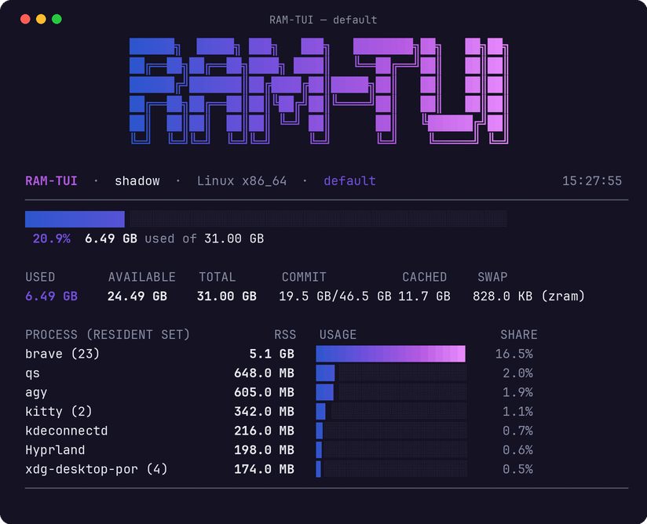 | Electric Violet (`#7030EF`) → Neon Purple (`#A846FF`) → Vivid Fuchsia (`#DB1FFF`) → Light Lilac (`#E0B3FF`) |
| **`catppuccin`** | 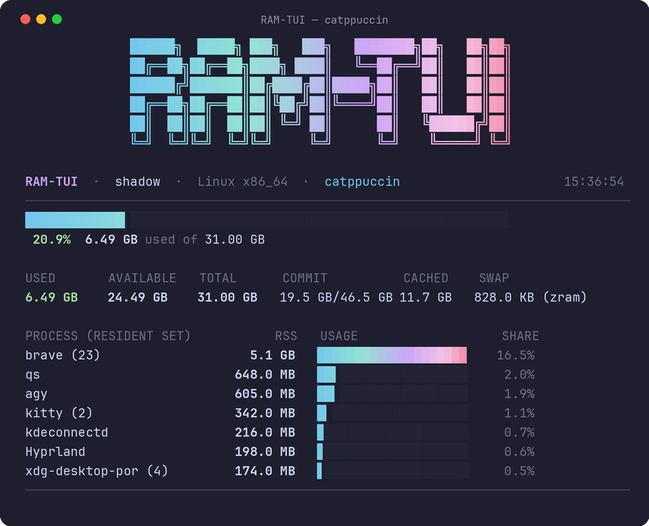 | Sapphire (`#74C7EC`) → Teal (`#94E2D5`) → Mauve (`#CBA6F7`) → Pink (`#F5C2E7`) → Maroon (`#F38BA8`) |
| **`dracula`** | 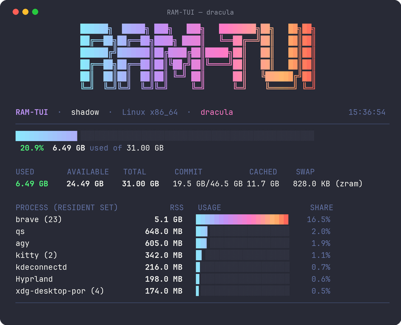 | Cyan (`#8BE9FD`) → Purple (`#BD93F9`) → Pink (`#FF79C6`) → Orange (`#FFB86C`) → Red (`#FF5555`) |
| **`tokyo-night`** | 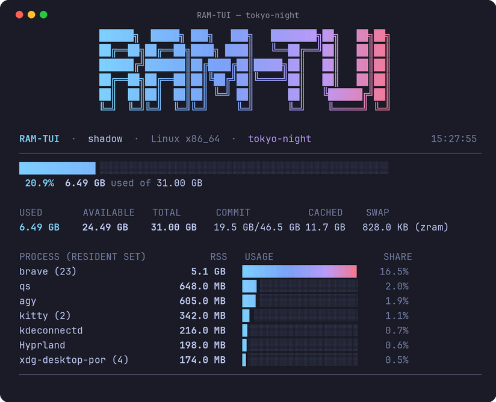 | Storm Cyan (`#7DCFFF`) → Tokyo Blue (`#7AA2F7`) → Magenta (`#BB9AF7`) → Warm Sunset (`#FF9E64`) → Red (`#F7768E`) |
| **`nord`** | 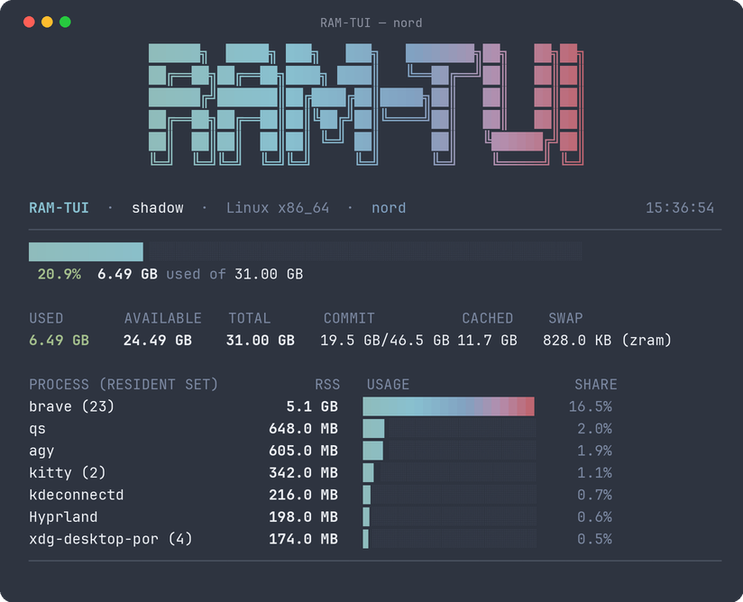 | Aurora Teal (`#8FBCBB`) → Frost Cyan (`#88C0D0`) → Frost Blue (`#81A1C1`) → Aurora Purple (`#B48EAD`) → Aurora Red (`#BF616A`) |
| **`gruvbox`** | 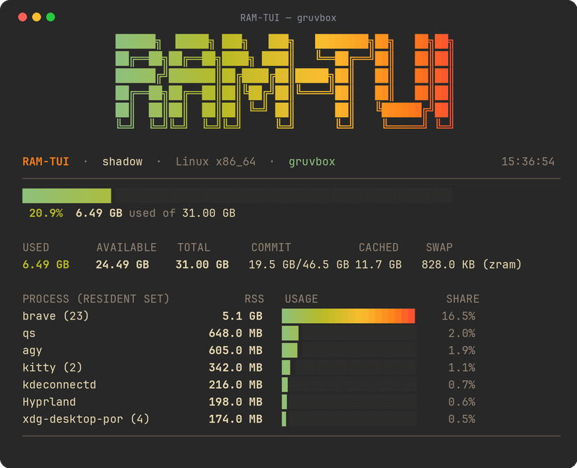 | Aqua (`#8EC07C`) → Green (`#B8BB26`) → Warm Yellow (`#FABD2F`) → Orange (`#FE8019`) → Red (`#FB4934`) |
| **`cyberpunk`** | 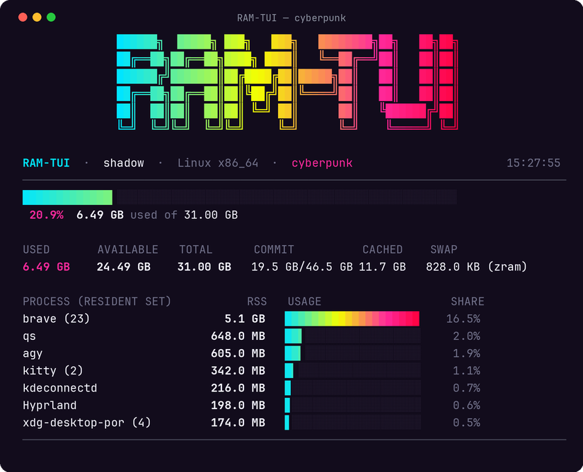 | Neon Cyan (`#00F0FF`) → Electric Yellow (`#FEE801`) → Hot Pink (`#FF007F`) → Neon Purple (`#9900FF`) → Crimson (`#FF003C`) |
| **`rose-pine`** | 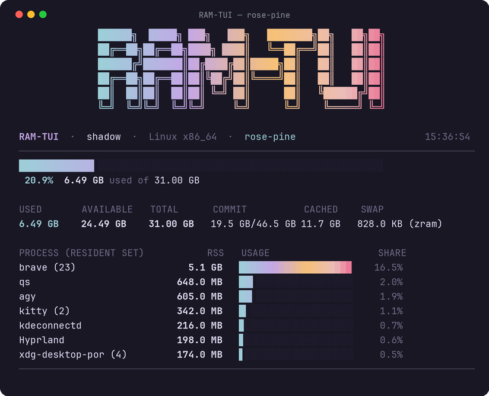 | Foam (`#9CCFD8`) → Iris (`#C4A7E7`) → Gold (`#F6C177`) → Rose (`#EBBCBA`) → Love Red (`#EB6F92`) |
| **`everforest`** | 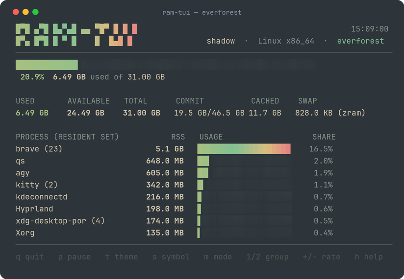 | Aqua (`#87C095`) → Forest Green (`#A7C080`) → Warm Yellow (`#DBBC7F`) → Orange (`#E69875`) → Soft Red (`#E67E80`) |
| **`kanagawa`** | 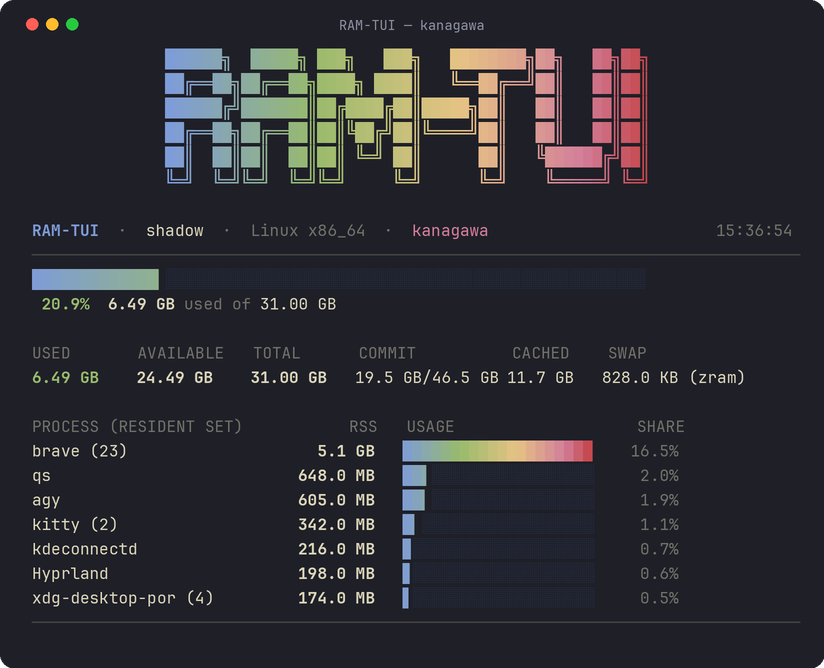 | Wave Blue (`#7E9CD8`) → Spring Green (`#98BB6C`) → Boat Yellow (`#E6C384`) → Sakura Pink (`#D27E99`) → Autumn Red (`#C34043`) |
| **`monokai`** | 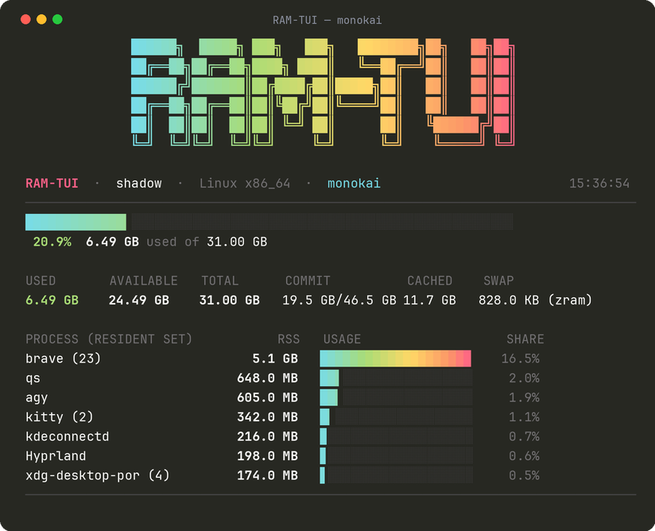 | Cyan (`#78DCE8`) → Bright Green (`#A9DC76`) → Yellow (`#FFD866`) → Orange (`#FC9867`) → Magenta Pink (`#FF6188`) |
| **`solarized`** | 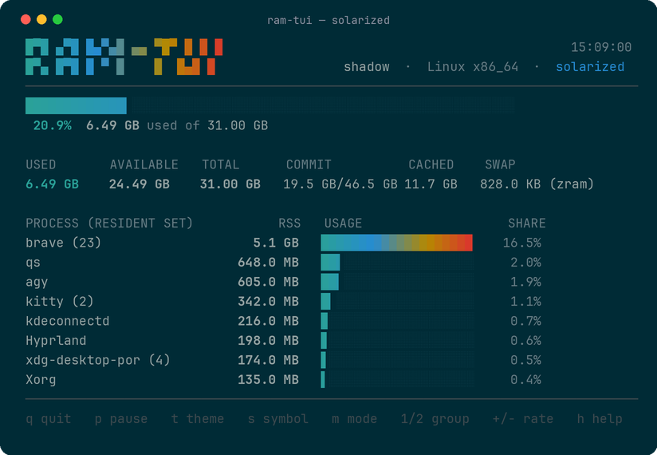 | Cyan (`#2AA198`) → Blue (`#268BD2`) → Violet (`#6C71C4`) → Yellow (`#B58900`) → Red (`#DC322F`) |
| **`monochrome`** | 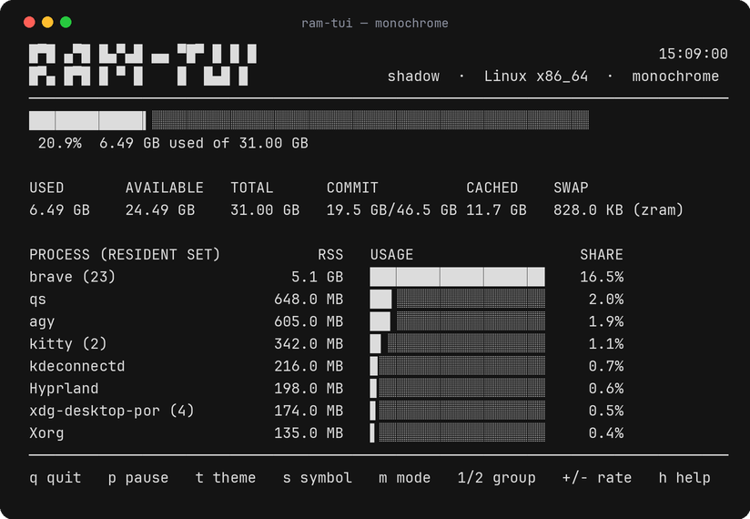 | Pure ANSI-free grayscale (auto-selected when `NO_COLOR` is set) |

---

## Display Modes

`RAM-TUI` provides four distinct display modes tailored for different terminal layouts and workflows:

| Mode | CLI Flag | Target Environment | Description |
|:---|:---|:---|:---|
| **Hero** | *(Default)* | Interactive terminals & fullscreen | Centered title, memory gauges, 60s sparkline trend, full 80-col metrics breakdown, and collapsible process tree. |
| **Compact** | `--compact` | Small windows & split panes | Centered title, memory gauges, sparkline, and metrics grid only, omitting the process list. |
| **Mini** | `--mini` | Narrow sidebar tiles & tmux splits | Compact single-line usage gauge and percentage meter. |
| **Tiny** | `--tiny` | Status bars (Waybar, Polybar, tmux) | Single raw plain text string (e.g. `RAM: 5.3 GB / 31.0 GB (17.2%)`) without ANSI escapes. |

---

## Deep Kernel Telemetry

Unlike traditional monitors that only report coarse RSS, `RAM-TUI v1.0.0` interfaces directly with advanced kernel subsystems:

```text
┌─────────────────────────────────────────────────────────────────────────────┐
│                             KERNEL TELEMETRY ENGINE                         │
├───────────────────────┬───────────────────────────────┬─────────────────────┤
│      Linux /proc      │          macOS Mach           │     Win32 PSAPI     │
├───────────────────────┼───────────────────────────────┼─────────────────────┤
│ • /proc/meminfo       │ • host_statistics64()         │ • GlobalMemoryStatus│
│ • /proc/swaps & zram  │ • sysctl(hw.memsize)          │ • PSAPI Working Set │
│ • smaps_rollup (PSS)  │ • sysctl(vm.swapusage)        │ • Private Commit    │
│ • smaps_rollup (USS)  │ • proc_pidinfo()              │ • Pagefile Commit   │
│ • Cgroups v2/v1 limits│ • Compressed memory pages     │ • Handle Validation │
└───────────────────────┴───────────────────────────────┴─────────────────────┘
```

* **PSS (Proportional Set Size)**: Accounts for shared memory by dividing shared pages evenly among sharing processes (`--sort pss`, Linux-specific via `/proc/<pid>/smaps_rollup`).
* **USS (Unique Set Size)**: Measures true private memory that would be returned to the OS if the process were killed (`--sort uss`, supported on Linux and Windows).
* **Cgroups v2 & v1 Detection**: Detects container memory limits (`memory.max` / `memory.limit_in_bytes`) and automatically budgets meters inside Docker and Kubernetes.

---

## Interactive Hotkeys

Control `RAM-TUI` live during interactive monitoring:

| Key | Action |
|:---|:---|
| `q` / `Ctrl+C` | Quit and cleanly restore original terminal buffer. |
| `Space` / `p` | Pause / Resume real-time telemetry updates. |
| `t` | Quick-cycle through 13 TrueColor themes live. |
| `T` (Shift+T) | Open the dedicated interactive **Theme Selector Window**. |
| `s` / `S` | Toggle gauge glyph symbol live (**Block** `█` <-> **Braille** `⣿`). |
| `m` / `M` | Cycle display modes live (**Hero** -> **Compact** -> **Mini**). |
| `1` | Group processes by executable name (default). |
| `2` | Display individual process PIDs. |
| `o` / `O` | Cycle sort metric live (Linux: **RSS** -> **PSS** -> **USS** -> **Name**; Windows: **RSS** -> **USS** -> **Name**; macOS: **RSS** -> **Name**). |
| `g` / `G` | Toggle 60-second historical trend sparkline. |
| `↑` / `↓` (`k`/`j`) | Navigate cursor across process entries. |
| `Enter` / `e` / `Tab`| Expand / Collapse process tree group (showing child PIDs `├─`, `└─`). |
| `/` | Open live interactive search & filter bar. |
| `Esc` | Clear search filter or close theme menu. |
| `x` / `K` | Terminate selected process (with safety confirmation prompt `[y/N]`). |
| `+` / `=` | Increase refresh rate (+25ms). |
| `-` / `_` | Decrease refresh rate (-50ms). |
| `h` / `?` | Toggle interactive hotkey help footer. |

---

## Status Bar Integration

`RAM-TUI` integrates natively with tiling window manager status bars and terminal multiplexers via `--tiny`:

### Waybar (Hyprland / Sway)
Add to your `~/.config/waybar/config.jsonc`:
```jsonc
"custom/ram": {
    "exec": "ram --tiny --once",
    "interval": 2,
    "format": "{}"
}
```

### tmux
Add to your `~/.tmux.conf`:
```tmux
set -g status-right "#(ram --tiny --once) | %H:%M "
set -g status-interval 2
```

### i3blocks
Add to your `~/.config/i3blocks/config`:
```ini
[memory]
command=ram --tiny --once
interval=2
```

---

## JSON Telemetry

For observability scripts, monitoring agents, and automation pipelines, `ram --json --once` emits structured JSON:

```bash
ram --json --once | jq '.memory'
```

```json
{
  "timestamp": "2026-09-02T00:45:00",
  "hostname": "shadow",
  "os": "Linux",
  "version": "1.0.3",
  "memory": {
    "total": 33299738624,
    "available": 26884991488,
    "used": 6414747136,
    "commit_as": 18834835968,
    "commit_limit": 49949607936,
    "cached": 18100220416,
    "swap_used": 1677721,
    "swap_total": 17179865088,
    "swap_desc": "zram",
    "cgroup": null,
    "valid": true
  },
  "top_processes": [
    {
      "name": "brave",
      "rss": 4404019200,
      "pss": 3145728000,
      "uss": 2621440000,
      "count": 21,
      "pid": 4120
    }
  ]
}
```

---

## Architecture

`RAM-TUI` is structured as a modular Cargo workspace:

```text
                                ram / ram-tui (CLI Entry)
                                           │
                   ┌───────────────────────┴───────────────────────┐
                   ▼                                               ▼
               collector                                      core_render
        (Direct Kernel Telemetry)                        (High-Speed Presenter)
                   │                                               │
    ┌──────────────┼──────────────┐                 ┌──────────────┼──────────────┐
    │              │              │                 │              │              │
  Linux          macOS         Windows         FrameBuffer      Sparkline      CellWidth
  /proc + smaps  Mach Kernel   PSAPI FFI       (Row Diffing)    (Auto-Ranging) (Unicode/CJK)
    │              │              │                 │              │              │
    └──────────────┼──────────────┘                 └──────────────┼──────────────┘
                   ▼                                               ▼
           System Telemetry ──────────────────────────────► UI Presentation
                                                                (13 Themes)
```

---

## Security & Invariants

`RAM-TUI` is engineered with strict defense-in-depth principles:

* **Zero Network Telemetry**: `RAM-TUI` never sends telemetry, metrics, or host metadata across the network.
* **Cache-Only Hotkeys & Targeted Verification**: Non-destructive UI hotkeys operate strictly in memory on cached telemetry; process termination (`x`/`K`) performs targeted identity verification prior to signaling.
* **Sanitization Invariant**: Strips ANSI escapes, ASCII controls, and Unicode bidirectional overrides from process comms and hostnames.
* **Process Termination Gate**: Process killing requires explicit keyboard confirmation (`[y/N]`).

For full details, see [SECURITY.md](SECURITY.md).

---

## CLI Reference

```text
Usage: ram [OPTIONS]

Options:
  -r, --rate <RATE>        Refresh interval in milliseconds (20–2000, default: 50)
  -n, --count <COUNT>      Number of top processes (1–10000, default: 8)
  -1, --once               Output one snapshot and exit
      --json               Output one JSON snapshot and exit
      --no-group           Show individual process PIDs instead of grouping
      --compact            Compact mode: memory meters only, no process list
      --mini               Mini mode: single usage bar + percentage only
      --tiny               Tiny mode: single line output for status bars
      --theme <THEME>      Color theme [default: default]
      --symbol <SYMBOL>    Meter graph style: 'block' or 'braille' [default: block]
      --sort <SORT>        Process sorting metric: 'rss', 'pss', 'uss', or 'name' [default: rss]
      --spark              Enable 60-second rolling memory trend sparkline (default: off, toggle with 'g')
      --debug              Enable verbose diagnostic error logging to ~/.cache/ram-tui/debug.log
      --filter <FILTER>    Initial process search filter string
  -h, --help               Print help
  -V, --version            Print version
```

---

## Automated Verification

Run the full automated test suite (66 tests):

```bash
cargo test --workspace
```

Run strict clippy linter:

```bash
cargo clippy --workspace --all-targets -- -D warnings
```

---

## License

MIT License (c) 2026 Raven (BlackFeather) — See [LICENSE](LICENSE) for details.
