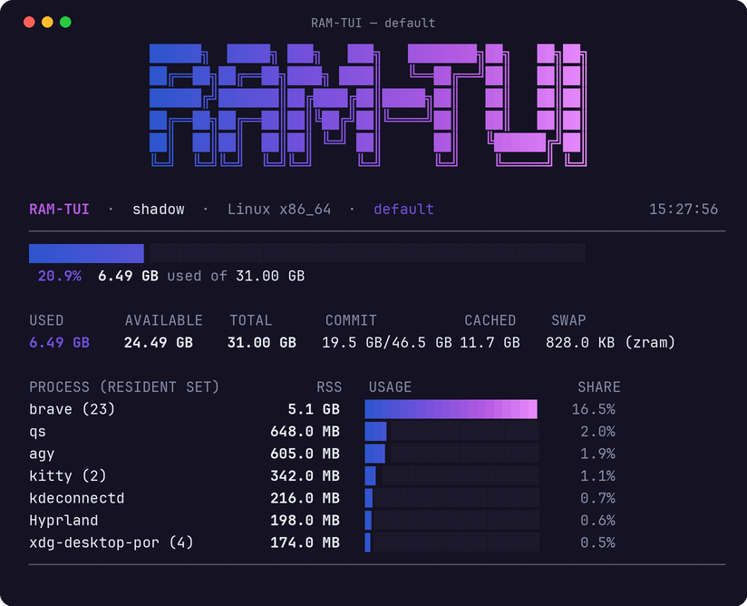

<div align="center">

# RAM-TUI

**A lightweight, aesthetic, zero-dependency real-time terminal memory monitor.**

*Linux · macOS · Windows · 24-bit TrueColor · 50ms Ultra-Low Latency · Cryptographic Root of Trust*

<br />



<br />

[](https://github.com/BlackFeather-git/ram-tui/actions)
[](https://github.com/BlackFeather-git/ram-tui/releases)
[](https://www.python.org)
[]()
[](LICENSE)
[](tests/)

[Why RAM-TUI?](#why-ram-tui) · [Features](#features) · [Display Modes](#display-modes) · [Quick Start](#quick-start) · [Installation](#installation) · [CLI Reference](#cli-reference) · [Color Themes](#color-themes) · [Architecture](#architecture)

</div>

---

## Why ram-tui?

Most system monitors try to display everything simultaneously: CPU cores, network interfaces, disk IOPS, fans, temperatures, and battery states. This complexity introduces heavy background overhead, complex dependency trees, and noisy visual clutter.

`ram-tui` focuses strictly on one core question: **how is memory actually being utilized right now?**

It combines direct kernel telemetry, resident set size (RSS) process rankings, responsive 2D terminal geometry, ricing-ready palettes, and machine-readable output into a single standalone executable with **zero external dependencies**.

| Dimension | Traditional System Monitors | ram-tui |
|:---|:---|:---|
| **Focus** | Multi-system everything-monitor | Memory-first telemetry & process attribution |
| **Dependencies** | Python packages (`pip`), native C extensions, or toolchains | Pure standard library (0 external dependencies) |
| **Telemetry** | Generic polling wrappers or heavy subprocesses | Direct kernel reads (`/proc`, `sysctl`/`vm_stat`, Win32 PSAPI) |
| **Rendering** | Full screen clears (`\033[2J`) with visible flicker | Differential cursor repositioning (`\033[H`) + per-line clear (`\033[K`) |
| **Layout** | Fixed grids prone to line wrapping on resize | Dynamic centered layout with `SIGWINCH` resize handling |
| **Updates** | Unauthenticated pip/git pulls or manual downloads | Cryptographically signed (RSA-2048 PKCS#1 v1.5 + SHA-256 + AST) |

---

## Features

### Native Kernel Telemetry
- **Linux:** Direct zero-subprocess parsing of `/proc/meminfo`, `/proc/swaps`, `/sys/block/zram*`, and `/proc/[pid]/stat`.
- **macOS:** Pure `sysctl` (`hw.memsize`, `vm.swapusage`) and Mach `vm_stat` page accounting with non-negative arithmetic bounds.
- **Windows:** Zero-overhead Win32 PSAPI FFI (`GlobalMemoryStatusEx`, `CreateToolhelp32Snapshot`, `K32GetProcessMemoryInfo`) with guaranteed handle reclamation.

### Real-Time Fluid Performance
- Default **50ms (20 FPS)** refresh rate for real-time monitoring.
- **Sub-millisecond frame latency** (~0.29ms per frame) with **<0.6% single-core CPU overhead**.
- Flat memory footprint (<10 MB RSS) with zero heap churn during steady-state rendering.

### Terminal-Safe Adaptive Geometry
- **Dynamic Horizontal Centering:** Centers dashboard layout on wide viewports ($>80$ columns) without stretched divider lines.
- **Resize & Reflow Protection:** OS `SIGWINCH` signal handler and per-tick geometry detection eliminate ghost characters during window resizing.
- **Per-Line Erase (`\033[K`):** Clears each line to the right margin before newlines.
- **Alternate Screen Buffer (`\033[?1049h`):** Dedicated terminal buffer prevents scrollback pollution in GPU terminals (Kitty, Alacritty, WezTerm).
- **Sub-Character Gauges:** Smooth high-resolution fractional block tracks (`█▉▊▋▌▍▎▏`) and Braille tracks (`⣿⡇`).

### Process Intelligence
- Aggregates multi-process instances (e.g. `brave (23)`, `kitty`) with $O(N \log K)$ bounded extraction.
- **Starttime-Keyed PID Cache:** Linux process starttime keying (field 22 of `/proc/[pid]/stat`) prevents PID-reuse race conditions.
- Proportional color-coded process consumption meters based on true system RAM fraction.

### Cryptographic Root of Trust
- Built-in fail-closed self-updater (`ram --update`).
- Releases mathematically verified against an embedded maintainer RSA-2048 public key before bytecode compilation or atomic replacement.

---

## Display Modes

`ram-tui` provides four distinct display modes tailored for different terminal layouts and workflows:

| Mode | CLI Flag | Target Environment | Description |
|:---|:---|:---|:---|
| **Hero** | *(Default)* | Interactive terminals & fullscreen | Full dashboard with live memory gauges, 6-column breakdown metrics grid, and live top process rankings. |
| **Compact** | `--compact` | Small windows & split panes | Memory gauges and metrics breakdown grid only, omitting the process list. |
| **Mini** | `--mini` | Narrow sidebar tiles & tmux splits | Compact single-line usage gauge and percentage meter. |
| **Tiny** | `--tiny` | Status bars (Waybar, Polybar, tmux) | Single raw plain text string (e.g. `RAM: 6.1 GB / 31.0 GB (19.8%)`) without ANSI escapes. |

---

## Quick Start

Launch `ram-tui` immediately:

```bash
# 1. Launch default interactive dashboard
ram

# 2. Launch with Catppuccin theme & Braille gauges
ram --theme catppuccin --symbol braille

# 3. Compact mode for split terminal panes
ram --compact --theme nord

# 4. Single-line snapshot for status bars or scripts
ram --tiny --once

# 5. Export machine-readable JSON telemetry
ram --json --once
```

---

## Installation

### Recommended: One-Line Installer (Linux & macOS)

Installs the standalone binary and configures shell completions automatically:

```bash
curl -fsSL https://raw.githubusercontent.com/BlackFeather-git/ram-tui/main/install.sh | bash
```

### Windows (PowerShell)

Run in PowerShell or Windows Terminal:

```powershell
irm https://raw.githubusercontent.com/BlackFeather-git/ram-tui/main/install.ps1 | iex
```

### Package Managers

#### Arch Linux (AUR)
```bash
# Via AUR helper (paru or yay)
paru -S ram-tui

# Or build manually with included PKGBUILD
git clone https://github.com/BlackFeather-git/ram-tui.git
cd ram-tui && makepkg -si
```

#### Homebrew (macOS & Linux)
```bash
brew install BlackFeather-git/tap/ram-tui
```

#### Scoop (Windows)
```powershell
scoop install https://raw.githubusercontent.com/BlackFeather-git/ram-tui/main/packaging/scoop/ram.json
```

#### Debian / Ubuntu (.deb)
```bash
# Download latest .deb from Releases
sudo dpkg -i ram-tui_*_all.deb
```

### Manual Installation (Any OS)

Download the standalone `ram` script directly to any directory in your `PATH`:

```bash
# Linux / macOS
curl -fsSL https://raw.githubusercontent.com/BlackFeather-git/ram-tui/main/ram -o ~/.local/bin/ram
chmod +x ~/.local/bin/ram

# Windows (Command Prompt / PowerShell)
curl -fsSL https://raw.githubusercontent.com/BlackFeather-git/ram-tui/main/ram -o %USERPROFILE%\.local\bin\ram.py
```

---

## CLI Reference

```text
usage: ram [-h] [-r RATE] [-n COUNT] [-1] [--json] [--no-group] [--compact]
           [--mini] [--tiny]
           [--theme {default,dracula,catppuccin,nord,tokyo-night,gruvbox,cyberpunk,rose-pine,everforest,kanagawa,monokai,solarized,monochrome}]
           [--symbol {block,braille}] [--update] [--force] [--check-update]
           [--no-update-check] [-v]
```

| Option | Argument | Description | Default |
|:---|:---|:---|:---|
| `-r`, `--rate` | `RATE` | Refresh interval in milliseconds (20–2000 ms). | `50` |
| `-n`, `--count` | `COUNT` | Number of top processes to track (1–10000). | `8` |
| `-1`, `--once` | *(None)* | Output one snapshot and exit immediately. | `False` |
| `--json` | *(None)* | Output structured JSON snapshot and exit. | `False` |
| `--no-group` | *(None)* | Display individual process PIDs instead of aggregating by name. | `False` |
| `--compact` | *(None)* | Compact mode: memory gauges and metrics grid only. | `False` |
| `--mini` | *(None)* | Mini mode: single gauge bar and percentage. | `False` |
| `--tiny` | *(None)* | Tiny mode: single line output for status bars (Waybar, tmux). | `False` |
| `--theme` | `NAME` | Color palette (13 built-in 24-bit TrueColor themes). | `default` |
| `--symbol` | `STYLE` | Meter graph style: `block` or `braille`. | `block` |
| `--update` | *(None)* | Perform cryptographically authenticated in-place self-update. | `False` |
| `--force` | *(None)* | Force update even if package manager installation is detected. | `False` |
| `--check-update` | *(None)* | Query latest release status without modifying binary. | `False` |
| `--no-update-check` | *(None)* | Disable non-blocking background update checks. | `False` |
| `-v`, `--version` | *(None)* | Show program version and exit. | — |

---

## Interactive Hotkeys

While running interactively in your terminal, control `ram-tui` in real time with single keystrokes:

| Key | Action |
|:---|:---|
| `q` / `Ctrl+C` | Quit and cleanly restore original terminal buffer. |
| `Space` / `p` | Pause / Resume real-time telemetry updates. |
| `t` / `T` | Cycle through color themes live (**Dracula**, **Catppuccin**, **Nord**, **Tokyo Night**, etc.). |
| `s` / `S` | Toggle gauge glyph symbol live (**Block** `█` <-> **Braille** `⣿`). |
| `m` / `M` | Cycle display modes live (**Hero** -> **Compact** -> **Mini**). |
| `1` | Group processes by executable name (default). |
| `2` | Display individual process PIDs. |
| `+` / `=` | Increase refresh rate (+25ms). |
| `-` / `_` | Decrease refresh rate (-50ms). |
| `h` / `?` | Toggle interactive hotkey help footer. |

---

## Status Bar Integration

`ram-tui` integrates natively with tiling window manager status bars and terminal multiplexers via `--tiny`:

### Waybar (Hyprland / Sway)
Add to your `~/.config/waybar/config.jsonc`:
```jsonc
"custom/ram": {
    "exec": "ram --tiny --once",
    "interval": 2,
    "format": "{}"
}
```

### tmux
Add to your `~/.tmux.conf`:
```tmux
set -g status-right "#(ram --tiny --once) | %H:%M "
set -g status-interval 2
```

### i3blocks
Add to your `~/.config/i3blocks/config`:
```ini
[memory]
command=ram --tiny --once
interval=2
```

---

## JSON Telemetry

For observability scripts, monitoring agents, and automation pipelines, `ram --json --once` emits raw, machine-readable JSON:

```bash
ram --json --once | jq '.memory'
```

```json
{
  "timestamp": "2026-09-01T13:50:00.123456",
  "version": "0.6.1",
  "system": {
    "os": "Linux",
    "hostname": "shadow",
    "machine": "x86_64"
  },
  "memory": {
    "total_bytes": 33299738624,
    "available_bytes": 26698125312,
    "used_bytes": 6601613312,
    "used_percent": 19.82,
    "commit_as": 21367484416,
    "commit_limit": 49949607936,
    "cached_bytes": 14283456512,
    "swap_used_bytes": 634880,
    "swap_total_bytes": 17179865088,
    "swap_desc": "zram"
  },
  "top_processes": [
    {
      "name": "brave",
      "rss": 5046599680,
      "count": 23,
      "pid": 4120
    },
    {
      "name": "qs",
      "rss": 644349952,
      "count": 1,
      "pid": 5891
    }
  ]
}
```

> **Clean Output Guarantee:** JSON mode emits valid JSON to `stdout` with zero ANSI escape codes, zero progress messages, and no interactive controls.

---

## Color Themes

`ram-tui` features 13 built-in 24-bit TrueColor themes with real-time gradient interpolation. Switch themes at startup with `--theme <name>` or cycle live anytime with `t`:

| Theme | Preview | Gradient Spectrum |
|:---|:---:|:---|
| **`catppuccin`** |  | Sapphire (`#74C7EC`) → Teal (`#94E2D5`) → Mauve (`#CBA6F7`) → Maroon (`#F38BA8`) |
| **`dracula`** |  | Cyan (`#8BE9FD`) → Purple (`#BD93F9`) → Pink (`#FF79C6`) → Red (`#FF5555`) |
| **`tokyo-night`** |  | Storm Cyan (`#7DCFFF`) → Tokyo Blue (`#7AA2F7`) → Magenta (`#BB9AF7`) → Red (`#F7768E`) |
| **`nord`** |  | Frost Cyan (`#88C0D0`) → Frost Blue (`#81A1C1`) → Yellow (`#EBCB8B`) → Aurora Red (`#BF616A`) |
| **`gruvbox`** |  | Aqua (`#8EC07C`) → Green (`#B8BB26`) → Warm Yellow (`#FABD2F`) → Orange Red (`#FB4934`) |
| **`cyberpunk`** |  | Neon Cyan (`#00E5FF`) → Electric Yellow (`#F4FF00`) → Hot Pink (`#FF2A9D`) → Crimson (`#FF003C`) |
| **`rose-pine`** |  | Foam (`#9CCFD8`) → Iris (`#C4A7E7`) → Gold (`#F6C177`) → Love Red (`#EB6F92`) |
| **`everforest`** |  | Forest Green (`#A7C080`) → Sage (`#83C092`) → Yellow (`#DBBC7F`) → Red (`#E67E80`) |
| **`kanagawa`** |  | Wave Blue (`#7E9CD8`) → Spring Green (`#98BB6C`) → Sakura Pink (`#D27E99`) → Autumn Red (`#C34043`) |
| **`monokai`** |  | Cyan (`#66D9EF`) → Bright Green (`#A6E22E`) → Yellow (`#E6DB74`) → Magenta (`#F92672`) |
| **`solarized`** |  | Cyan (`#2AA198`) → Blue (`#268BD2`) → Warm Yellow (`#B58900`) → Red (`#DC322F`) |
| **`default`** |  | Dark Blue (`#2D55CD`) → Royal Violet (`#7350DC`) → Midnight Purple (`#B45AE1`) → Neon Lavender (`#EB8CFF`) |
| **`monochrome`** |  | Pure ANSI-free grayscale (auto-selected when `NO_COLOR` is set) |

---

## Platform Support

| Platform | Kernel Interface | Swap / Compressed Memory | Process Attribution | Zero Dependencies |
|:---|:---|:---|:---|:---:|
| **Linux** | `/proc/meminfo` direct parsing | `/proc/swaps` + `/sys/block/zram*` detection | `/proc/[pid]/stat` with starttime keying | Yes |
| **macOS** | Mach `vm_stat` + `sysctl hw.memsize` | `sysctl vm.swapusage` compressed parsing | `ps -axo pid,rss,comm` | Yes |
| **Windows** | Win32 `GlobalMemoryStatusEx` | Commit limit & pagefile allocation | Win32 Toolhelp32 + PSAPI FFI | Yes |

---

## Architecture

`ram-tui` is organized as a single-file, highly cohesive architecture designed for maximum portability:

```text
                             ram (Entry Point)
                                    │
           ┌────────────────────────┴────────────────────────┐
           ▼                                                 ▼
   Kernel Telemetry                                Presentation Engine
           │                                                 │
 ┌─────────┼─────────┐                     ┌─────────────────┼─────────────────┐
 │         │         │                     │                 │                 │
Linux    macOS    Windows             Display Modes     Theme Engine      Terminal Engine
/proc    sysctl    PSAPI              (Hero/Compact)    (13 TrueColor)    (Raw / AltBuffer)
           │                               │                 │                 │
           └───────────────┬───────────────┘                 │                 │
                           ▼                                 │                 │
                  Dynamic 2D Geometry ◄──────────────────────┴─────────────────┘
                (Centered / SIGWINCH Safe)
```

---

## Security & Updates

`ram-tui` features a built-in cryptographic self-updater (`ram --update`) designed with defense-in-depth:

```text
GitHub Release Payload
          │
          ▼
SHA-256 Digest Verification (ram.sha256)
          │
          ▼
Maintainer RSA-2048 PKCS#1 v1.5 Verification (ram.sig)
          │
          ▼
Python Bytecode Compilation & AST Semantic Verification
          │
          ▼
Privileged Path & TOCTOU Symlink Validation
          │
          ▼
Atomic Executable Replacement (os.replace)
```

### Security Guarantees
1. **Maintainer Public Key Root of Trust:** Embedded RSA-2048 public key modulus and exponent mathematically verify release signatures before code execution.
2. **Constant-Time Verification:** Uses `hmac.compare_digest()` for signature digest comparisons.
3. **AST Semantic Validation:** Standard library `ast.parse()` confirms authentic module-level `__version__` declarations and `if __name__ == "__main__":` entry blocks, preventing spoofing.
4. **TOCTOU Symlink Mitigation:** Validates that target paths and parent directories are genuine physical paths immediately prior to replacement.
5. **Package Manager Guard:** Fails closed if the binary is situated in system-managed paths (`/usr/bin`, `/opt/homebrew`, `\scoop\shims`) unless `--force` is provided.

For full details, see [SECURITY.md](SECURITY.md).

---

## Development

### Running the Test Suite

Run the full automated test suite locally (52 tests):

```bash
python3 -m unittest discover tests
```

### Validating Compilation

```bash
python3 -m compileall ram
```

For contribution guidelines and coding standards, see [CONTRIBUTING.md](CONTRIBUTING.md).

---

## Changelog

See [CHANGELOG.md](CHANGELOG.md) for full version history and release notes.

---

## License

MIT License (c) 2026 Raven (BlackFeather) — See [LICENSE](LICENSE) for details.
